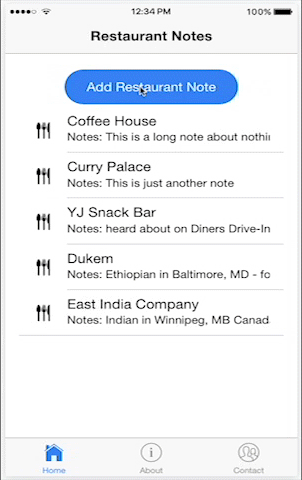

# Restaurant Notes

This is the Ionic 2 portion of my final Capstone project for NSS.

The idea for this came about from notes I've collected while traveling for the past 25 years. For many cities I visited, I'd open the "Notes" app on my iPhone (or sometimes a paper notebook I was carrying) and write a stream of consciousness entry so that I could remember details about the experience, location of the place, or any other details.

Unfortunately this didn't make for an easily searchable list, or a very organized one, so I've always wished there was an app for it. After attending Nashville Software School and learning some of the technologies and techniques I might use to build that sort of app, I decided to build my own, "Restaurant Notes".

I'm very interested in producing mobile apps and it's definitely where this app seems most useful, so I wanted to make a hybrid app, usable for iPhone or Android. For now, I've focused solely on building the iOS version only, but feel confident I can also produce an Android version soon.

This is the repository for that app. Feel free to pull it down and see what you think.

You will also need the API, which I built using Django and SQLite3 for the database. You can find the repository to help build that API here, [NSS-FinalCapstone-RestaurantNotes](https://github.com/markellisdev/NSS-FinalCapstone-RestaurantNotes)

I'd love to hear additional features you might add or would like to see.

Thanks for checking it out!

#### - markellisdev

### A gif example of what the app does

### A screenshot of Restaurant Notes

